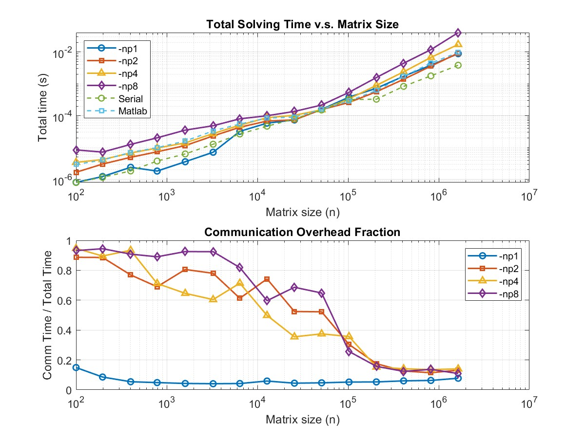

##  04/30/2025  Test different Synthtic Matrix from 5-point stencil FDM  
We solve each matrix of size
n = {100, 196, 400, 784, 1600, 3249, 6400, 12769, 25600, 51076, 102400, 205209, 409600, 819025, 1638400}
1000 times to obtain reliable performance measurements.
The plots below show:
- Total solving time (i.e., computation + communication) vs. matrix size, along with the proportion of communication time:  
 [View the full image](./images/comm_fraction_analysis.pdf)
  

- The following plot represent the result that solving the matrix without collecting communication time cost:  
[View the full image](./images/performance_loglog_plot.pdf)

---
The following tables present detailed results.   
Each entry is formatted as: Communication Time / Solving Time
| Matrix size  | -np 1       | -np 2     | -np 4     |  -np 8      | Serial      | Matlab      |
|--------------|-------------|-----------|-----------|-------------|-------------|-------------|
| 100          |1.20428e-07 / 8.0755e-07 | 1.48498e-06 / 1.67449e-06 | 3.2437e-06 / 3.42692e-06 | 7.85896e-06 / 8.43429e-06 | 8.01e-07 | 2.953e-6 |
| 196          |1.05473e-07 / 1.2319e-06 | 2.68985e-06 / 3.03607e-06 | 3.7603e-06 / 4.19885e-06 | 6.81244e-06 / 7.2129e-06 | 1.162e-06 | 4.052e-6 |
| 400          |1.29807e-07 / 2.39943e-06 | 3.80134e-06 / 4.94267e-06 | 6.33328e-06 / 6.78259e-06| 1.14057e-05 / 1.25579e-05 | 1.846e-06| 7.06e-6 |
| 784          |8.8712e-08 / 1.83165e-06 | 5.08303e-06 / 7.36841e-06 | 6.8638e-06 / 9.64669e-06 | 1.80025e-05 / 2.02149e-05 | 3.777e-06 | 9.92e-6 |
| 1,600        |1.52985e-07 / 3.59271e-06 | 9.30156e-06 / 1.15498e-05 | 9.05721e-06 / 1.40258e-05 | 3.26193e-05 / 3.52542e-05 | 6.313e-06 |1.606e-5|
| 3,249        | 2.91565e-07 / 7.13384e-06 | 1.80323e-05 / 2.31221e-05 | 1.65666e-05 / 2.74331e-05 | 4.47414e-05 / 4.84028e-05 | 1.2716e-05 | 3.3142e-5|
| 6,400        | 1.35785e-06 / 3.22403e-05 | 2.65281e-05 / 4.32929e-05 | 3.59741e-05 / 5.04078e-05 | 6.53635e-05 / 7.98827e-05 | 2.665e-05 |5.4843e-5|
| 12,769       | 3.43168e-06 / 5.8413e-05 | 5.05207e-05 / 6.80688e-05 | 4.31318e-05 / 8.6591e-05 | 5.93647e-05 / 9.94987e-05 | 4.6721e-05 |8.4355e-5|
| 25,600       | 3.27033e-06 / 7.35209e-05 | 3.86736e-05 / 7.38085e-05 | 3.65117e-05 / 0.000102922 | 9.34309e-05 / 0.000136147 | 7.9191e-05 | 9.0595e-5 |
| 51,076       | 7.39938e-06 / 0.000158103 | 8.12603e-05 / 0.000155633 | 5.7467e-05 / 0.000153379 | 0.000139833 / 0.000215765 | 0.000150698 | 1.57424e-4|
| 102,400      | 1.97912e-05 / 0.000381198 | 7.89623e-05 / 0.000259933 | 0.000119992 / 0.000336378 | 0.000138857 / 0.000540657 | 0.000322169 | 2.89946e-4|
| 205,209      | 3.82397e-05 / 0.000724037 | 9.85569e-05 / 0.000563137 | 0.000136455 / 0.000895678 | 0.000247143 / 0.00157281 | 0.000329027 | 6.17428e-4 |
| 409,600      | 0.00010331 / 0.00172349 | 0.000174667 / 0.00138712 | 0.000334474 / 0.00237048 | 0.000545489 / 0.00441417 | 0.000831384 |1.711629e-3|
| 819,025      | 0.000241366 / 0.00384201 | 0.000409607 / 0.00357666 | 0.000910166 / 0.00672928 | 0.00161314 / 0.0117813 | 0.00177419 |4.489057e-3|
| 1,638,400    | 0.000685039 / 0.00883354 | 0.00120741 / 0.00918623 | 0.00240251 / 0.0171404 | 0.00440842 / 0.0404561 | 0.00383624 |9.648871e-3|

---
**Using interleaved (round-robin) partition, solving time w/o collecting communication time:**     
| Matrix size  | -np 1      | -np 2      | -np 4      |  -np 8      | Serial      | Matlab      |
|--------------|------------|------------|------------|-------------|-------------|-------------|
| 100          |4.75214e-07 |1.40494e-06 |5.18376e-06 | 8.26106e-06 | 4.07e-07    |2.953e-6     |
| 196          |4.75365e-07 |2.77194e-06 |5.94185e-06 | 1.31004e-05 | 1.141e-06   |4.052e-6     |
| 400          |8.67812e-07 |3.88616e-06 |6.93934e-06 | 1.20674e-05 | 1.889e-06   |7.06e-6      |
| 784          |1.66867e-06 |6.33989e-06 |1.02154e-05 | 1.91419e-05 | 3.412e-06   | 9.92e-6     |
| 1,600        |6.84793e-06 |1.08037e-05 |1.34171e-05 | 3.34082e-05 | 6.351e-06   | 1.606e-5    |
| 3,249        |1.27891e-05 |2.27439e-05 |2.82453e-05 | 4.84117e-05 | 1.3775e-05  |3.3142e-5    |
| 6,400        |1.33112e-05 |3.71782e-05 |4.6065e-05  | 7.67492e-05 | 2.6653e-05  |5.4843e-5    | 
| 12,769       |6.09444e-05 |5.99509e-05 |7.71124e-05 | 0.000102193 | 4.4368e-05  |8.4355e-5    |
| 25,600       |0.00012006  |0.000109591 |0.000109141 | 0.000148905 | 4.7147e-05  |9.0595e-5    |
| 51,076       |0.000186218 |0.000149326 |0.000151831 | 0.000193261 |0.00014542   |1.57424e-4   |
| 102,400      |0.00033724  |0.000211961 | 0.000294029| 0.00053251  |0.000204724  |2.89946e-4   |
| 205,209      |0.00075166  |0.000572648 | 0.000898114| 0.00155746  |0.000451118  |6.17428e-4   |
| 409,600      |0.00171776  |0.001389    | 0.00230323 | 0.00432287  | 0.000860815 | 1.711629e-3 |
| 819,025      |0.00375482  |0.00358436  | 0.00671502 | 0.00669452  |0.00182312   |4.489057e-3  |
| 1,638,400    |0.00849241  |0.00915114  | 0.0171226  | 0.0407249   |0.00385348   |9.648871e-3  |

---
**05/05/2025**
**Using block partition, solving time w/o collecting communication time:**     
| Matrix size  | -np 1      | -np 2      | -np 4      |  -np 8      | Serial      | Matlab      |
|--------------|------------|------------|------------|-------------|-------------|-------------|
| 100          |2.47e-7     |1.989e-6    |4.218e-06   | 7.164e-06   | 4.07e-07    |2.953e-6     |
| 196          |4.88e-07    |2.718e-06   |4.565e-06   | 1.1681e-05  | 1.141e-06   |4.052e-6     |
| 400          |1.901e-06   |5.381e-06   |7.965e-06   | 1.3192e-05  | 1.889e-06   |7.06e-6      |
| 784          |3.961e-06   |6.943e-06   |1.3452e-05  | 2.1038e-05  | 3.412e-06   | 9.92e-6     |
| 1,600        |6.871e-06   |1.4358e-05  |2.1029e-05  | 3.2338e-05  | 6.351e-06   | 1.606e-5    |
| 3,249        |1.4147e-05  |2.7645e-05  |3.5885e-05  | 5.9787e-05  | 1.3775e-05  |3.3142e-5    |
| 6,400        |1.3239e-05  |4.4852e-05  |6.0421e-05  | 8.7871e-05  | 2.6653e-05  |5.4843e-5    | 
| 12,769       |5.6603e-05  |7.9480e-05  |8.1457e-05  | 0.000104957 | 4.4368e-05  |8.4355e-5    |
| 25,600       |0.00012006  |0.000121091 |0.000124793 | 0.000110944 | 4.7147e-05  |9.0595e-5    |
| 51,076       |0.000156075 |0.00018327  |0.000153098 | 0.000160336 |0.00014542   |1.57424e-4   |
| 102,400      |0.000340515 |0.000289559 | 0.000268526| 0.000246470 |0.000204724  |2.89946e-4   |
| 205,209      |0.000722591 |0.000570194 | 0.000509713| 0.000573032 |0.000451118  |6.17428e-4   |
| 409,600      |0.001715294 |0.01463881  | 0.01347949 | 0.01713495  | 0.000860815 | 1.711629e-3 |
| 819,025      |0.003773503 |0.00351393  | 0.003465147| 0.004652711 |0.00182312   |4.489057e-3  |
| 1,638,400    |0.00868258  |0.008350198 | 0.008489711| 0.12028246  |0.00385348   |9.648871e-3  |
---

**05/06/2025**
**Block Partition used, evaluate thea** 
**Partition and Process Allocation moved out of solver**    
|Type                      | -np 1     | -np 2     | -np 4     | -np 8    |
|--------------------------|-----------|-----------|-----------|----------|
| Collective Communication | 0.063649  | 0.0491819 | 0.0476371 | 0.0495306|
| P2P Communication        | 7.15612   |  8.21236  |  7.06345  |  10.19741|
 
## 04/26/2025 Used a synthetic 2 level sparse matrix which n = 25600, density = 0.011669% 
|Exp        | -np 1      | -np 2     | -np 4     |  -np 8      | Serial      |
|-----------|------------|-----------|-----------|-------------|-------------|
| 100 times |0.000155298 |0.000177485|0.00022731 | 0.000249848 | 0.0000800272|
<!-- | 100 times |0.00010114  |0.000455158|0.000421344| 0.000611659 | 0.0000800272| -->

**[offshore.mat](https://sparse.tamu.edu/Um/offshore)** 
| Rows    | Cols    | Nonzeros  | Nonzeros per Row | Density      |
|---------|---------|-----------| -----------------|--------------|
| 259,789 | 259,789 | 4,242,673 | 16 average       | 0.0159515%   |
- **Symmetric**:	Yes 
- **Levels in total**: 13,486  
- Each level contains **19.26 rows on average**.
-  

**04/24/2025**
**Block Partition used** 
**Partition and Process Allocation moved out of solver**    
|Type     |Matlab    | -np 1     | -np 2     | -np 4     | -np 8    |
|---------|----------|-----------|-----------|-----------|----------|
| blocked | 0.116147 | 0.063649  | 0.0491819 | 0.0476371 | 0.0495306|

**04/22/2025** 
**Block Partition used** 
**The Average Result, solve 100 times each**
|Type     |Matlab    | -np 1     | -np 2    | -np 4     | -np 8    |
|---------|----------|-----------|----------|-----------|----------|
| blocked | 0.116147 | 0.0616060 | 0.0512058| 0.0483569 | 0.0504434|

**04/19/2025**      
**Block Partition used**   
**The Average Result, solve 100 times each:**
|Type     |Matlab    | -np 1     | -np 2    | -np 4     | -np 8    | Serial    |
|---------|----------|-----------|----------|-----------|----------|-----------|
| blocked |0.116147 | 0.0658924 | 0.053084 | 0.0501442 | 0.0569574| 0.0545086 |
|Non-block|-|       |         |

**[L_FEM_3D_thermal2_csr.mat](https://sparse.tamu.edu/Botonakis/FEM_3D_thermal2)** 

| Rows    | Cols    | Nonzeros  | Density      |
|---------|---------|-----------|--------------|
| 147,900 | 147,900 | 3,489,300 | 0.0062863%   |
- **Symmetric**:	No 
- **Levels in total**:  4200 
- **Each level contains** 35.21 rows on average.

- 

**Result in Seconds**
| -np 1     | -np 2    | -np 4    | -np 8    | Serial    |
|-----------|----------|----------|----------|-----------|
| 0.0183861 | 0.0383943| 0.0668708| 0.0990982| 0.0183794 |

**04/08/2025**  
**[offshore.mat](https://sparse.tamu.edu/Um/offshore)** 

**Result in Seconds**
|Matlab    | -np 1    | -np 2    | -np 4    | -np 8    | Serial    |
|----------|----------|----------|----------|----------|-----------|
|0.116147  | 0.107306 | 0.16881  | 0.236329 | 0.306209 | 0.0788363 |
|0.122958  | 0.105922 | 0.170062 | 0.23471  | 0.304186 | 0.0788557 |
|0.118623  | 0.10419  | 0.169313 | 0.235276 | 0.303561 | 0.563259  |
|          | 0.106042 | 0.169728 | 0.232909 | 0.306211 | 0.0814193 |
|          | 0.106131 | 0.172671 | 0.235012 | 0.305638 | 0.0830694 |
|          | 0.105438 | 0.167453 | 0.242096 | 0.30387  | 0.0834274 |
|          | 0.104456 | 0.171154 | 0.236112 | 0.307971 | 0.0830402 |

**[L_FEM_3D_thermal2_csr.mat](https://sparse.tamu.edu/Botonakis/FEM_3D_thermal2)** 

| Rows    | Cols    | Nonzeros  | Density      |
|---------|---------|-----------|--------------|
| 147,900 | 147,900 | 3,489,300 | 0.0062863%   |
- **Symmetric**:	No 
- **Levels in total**:  4200 
- **Each level contains** 35.21 rows on average.

- 

**Result in Seconds**
| -np 1    | -np 2    | -np 4    | -np 8    | Serial    |
|----------|----------|----------|----------|-----------|
| 0.031441 | 0.0584887| 0.0950567| 0.136148 | 0.0214026 |
| 0.0311085| 0.0578543| 0.095378 | 0.136597 | 0.022248  |
| 0.0312292| 0.0578645| 0.0953007| 0.136286 | 0.0216456 |
| 0.0309264| 0.0582753| 0.096561 | 0.136732 | 0.0216968 |
| 0.0309858| 0.0579846| 0.0956918| 0.136692 | 0.021489  |

**[Cage13.mat](https://sparse.tamu.edu/vanHeukelum/cage13)**

0.268917 
0.259517 sec