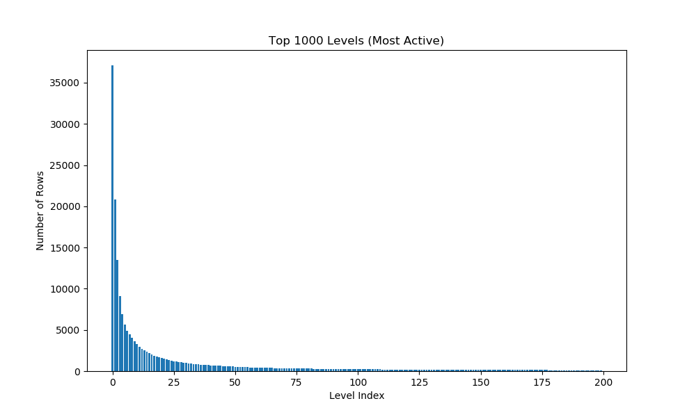
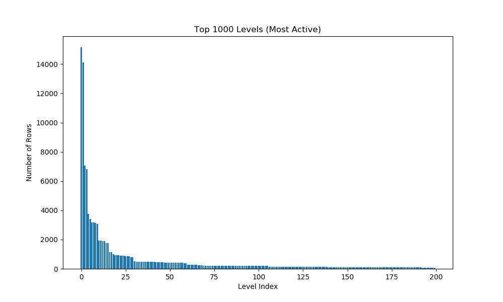

**[offshore.mat](https://sparse.tamu.edu/Um/offshore)** 
| Rows    | Cols    | Nonzeros  | Nonzeros per Row | Density      |
|---------|---------|-----------| -----------------|--------------|
| 259,789 | 259,789 | 4,242,673 | 16 average       | 0.0159515%   |
- **Symmetric**:	Yes 
- **Levels in total**: 13,486  
- Each level contains **19.26 rows on average**.
-  

**04/26/2025** 
**Used a synthetic 2 level sparse matrix which n = 25600, density = 0.011669%**    
|Exp        | -np 1      | -np 2     | -np 4     |  -np 8      | Serial      |
|-----------|------------|-----------|-----------|-------------|-------------|
| 100 times |0.000155298 |0.000177485|0.00022731 | 0.000249848 | 0.0000800272|
|  1  times |0.000124601 |0.00116101 |0.000253124|0.000286278  | 0.000087889 |
<!-- | 100 times |0.00010114  |0.000455158|0.000421344| 0.000611659 | 0.0000800272| -->

**04/24/2025**
**Block Partition used** 
**Partition and Process Allocation moved out of solver, Block Partition used**    
|Type     |Matlab    | -np 1     | -np 2     | -np 4     | -np 8    |
|---------|----------|-----------|-----------|-----------|----------|
| blocked | 0.116147 | 0.063649  | 0.0491819 | 0.0476371 | 0.0495306|

**04/22/2025** 
**Block Partition used** 
**The Average Result, solve 100 times each**
|Type     |Matlab    | -np 1     | -np 2    | -np 4     | -np 8    |
|---------|----------|-----------|----------|-----------|----------|
| blocked | 0.116147 | 0.0616060 | 0.0512058| 0.0483569 | 0.0504434|

**04/19/2025**      
**Block Partition used**   
**The Average Result, solve 100 times each:**
|Type     |Matlab    | -np 1     | -np 2    | -np 4     | -np 8    | Serial    |
|---------|----------|-----------|----------|-----------|----------|-----------|
| blocked  |0.116147 | 0.0658924 | 0.053084 | 0.0501442 | 0.0569574| 0.0545086 |
|Non-block|-|       |         |

**[L_FEM_3D_thermal2_csr.mat](https://sparse.tamu.edu/Botonakis/FEM_3D_thermal2)** 

| Rows    | Cols    | Nonzeros  | Density      |
|---------|---------|-----------|--------------|
| 147,900 | 147,900 | 3,489,300 | 0.0062863%   |
- **Symmetric**:	No 
- **Levels in total**:  4200 
- **Each level contains** 35.21 rows on average.

- 

**Result in Seconds**
| -np 1     | -np 2    | -np 4    | -np 8    | Serial    |
|-----------|----------|----------|----------|-----------|
| 0.0183861 | 0.0383943| 0.0668708| 0.0990982| 0.0183794 |

**04/08/2025**  
**[offshore.mat](https://sparse.tamu.edu/Um/offshore)** 

**Result in Seconds**
|Matlab    | -np 1    | -np 2    | -np 4    | -np 8    | Serial    |
|----------|----------|----------|----------|----------|-----------|
|0.116147  | 0.107306 | 0.16881  | 0.236329 | 0.306209 | 0.0788363 |
|0.122958  | 0.105922 | 0.170062 | 0.23471  | 0.304186 | 0.0788557 |
|0.118623  | 0.10419  | 0.169313 | 0.235276 | 0.303561 | 0.563259  |
|          | 0.106042 | 0.169728 | 0.232909 | 0.306211 | 0.0814193 |
|          | 0.106131 | 0.172671 | 0.235012 | 0.305638 | 0.0830694 |
|          | 0.105438 | 0.167453 | 0.242096 | 0.30387  | 0.0834274 |
|          | 0.104456 | 0.171154 | 0.236112 | 0.307971 | 0.0830402 |

**[L_FEM_3D_thermal2_csr.mat](https://sparse.tamu.edu/Botonakis/FEM_3D_thermal2)** 

| Rows    | Cols    | Nonzeros  | Density      |
|---------|---------|-----------|--------------|
| 147,900 | 147,900 | 3,489,300 | 0.0062863%   |
- **Symmetric**:	No 
- **Levels in total**:  4200 
- **Each level contains** 35.21 rows on average.

- 

**Result in Seconds**
| -np 1    | -np 2    | -np 4    | -np 8    | Serial    |
|----------|----------|----------|----------|-----------|
| 0.031441 | 0.0584887| 0.0950567| 0.136148 | 0.0214026 |
| 0.0311085| 0.0578543| 0.095378 | 0.136597 | 0.022248  |
| 0.0312292| 0.0578645| 0.0953007| 0.136286 | 0.0216456 |
| 0.0309264| 0.0582753| 0.096561 | 0.136732 | 0.0216968 |
| 0.0309858| 0.0579846| 0.0956918| 0.136692 | 0.021489  |

**[Cage13.mat](https://sparse.tamu.edu/vanHeukelum/cage13)**

0.268917 
0.259517 sec